  

  

 

  cs student · digital media & game development · HS Anhalt 
  the kind of person who reads interrupt handlers at 2am — and genuinely enjoys it

---

  ✦ &nbsp;<strong>VesperaOS</strong>&nbsp; ✦

  a freestanding x86_64 hobby kernel written in C++20 — built entirely from scratch. 🌊 
  no stdlib. no shortcuts. custom memory manager, intel blitter driver, vfs, ahci driver, and more. 
  just page tables, late nights, and a lot of QEMU restarts.

  

  
  
  
  
  
  

---

  

  
  

---

  

  made with 🧃 + compiler errors + a bit of chaos

  

